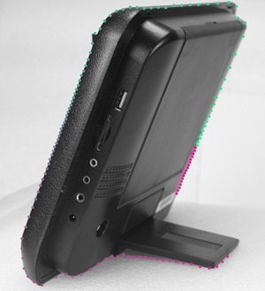
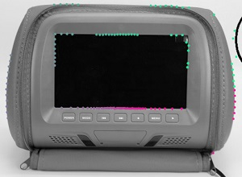

Imager  
OpenGL  
Convolution  


### Branch  

* Bounding  
  由外而内线段扫描，寻找边界点  
  效果并不理想  

  * Bounding_v0.1  
    修改边界辨别方案，保留整段扫描线单元的灰度值和坐标，  
    设置一个浮标，判断浮标前后10个单元的灰度总值差距，选出差距最大的节点作为边界  

    ```perl
    for my $i ( 10 .. $#points-10 ) {
        $sum1 = sum( @vals[ $i-10 .. $i ] ) ;
        $sum2 = sum( @vals[ $i .. $i+10 ] );
        if ( abs($sum2-$sum1) > $max ) {
            $max = abs($sum2-$sum1);
            $best = $i;
        }
    }
    ```

    效果：  
      

    不足之处：  
      

    