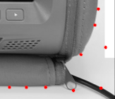
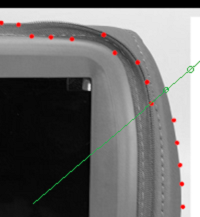

* ### ScanLine.pl  
  扫描线尝试  

* ### ScanLine_KNN_ALL_RGB.pl  
  扫描上下左右所有边界  

* ### ScanLine_KNN_ALL_Gray.pl  
  图像转为灰度图，k值的计算采用简单地 `$k = abs($curr-$prev);`  
  扫描上下左右所有边界  

* ### ScanLine_KNN_Nearly.pl  
  尝试在扫到一个点后沿着边界延伸，未完成  

* ### ScanLine_KNN_from_Center.pl  
  考虑到直线扫描会出现多个边界点，在勾勒整体轮廓的时候难以确定，  
  采用新的方案，从中点向外 360° 扫描，选择最外一个边界点  

  * center_v0.1  
    对于背景较为单纯的情况可以应付，如果外接还有其他轮廓，定位点会被"吸附"过去  
      
    初始方案是保留扫描得到的每个点坐标，找出离上一个结果最近的点，但也有可能吸  
    附到内侧的其他边缘：  
      
    以及如果第一个边界点就定位到了其他区域，邻近方案就失去意义了。  

  * center_nearly_by_vec  
    在获得两个边界点e1, e2 之后，求出 e2-e1 的向量
    第三次的扫描点假设为 p1 p2 p3 ... , 依次 减去 e2得到新的向量，对两个向量长度归一化
    寻找距离最近的向量。

  * center_nearly_by_dst  
    配合向量方案，求出 p点集合 和 最后一个 e点的距离，找出最近点，设定一个阀值，  
    如果达不到阀值，选择角度相近的点  
    ```perl
    if ( $dist_min < 5.0 ) { push @edges, $points[$dist_good]; }
    else                   { push @edges, $points[$vec_good]; }
    ```


### 相关知识
* #### 最小二乘法  
  http://blog.sina.com.cn/s/blog_b27f71160101gxun.html

* #### 曲线拟合  
  例子：http://www.oschina.net/code/snippet_103482_19167  

  