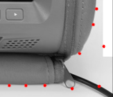

* ### ScanLine.pl  
  扫描线尝试  

* ### ScanLine_KNN.pl  
  扫描边界  

* ### ScanLine_KNN_ALL_RGB.pl  
  扫描上下左右所有边界  

* ### ScanLine_KNN_ALL_Gray.pl  
  图像转为灰度图，k值的计算采用简单地 `$k = abs($curr-$prev);`  
  扫描上下左右所有边界  

* ### ScanLine_KNN_Nearly.pl  
  尝试在扫到一个点后沿着边界延伸，未完成  

* ### ScanLine_KNN_from_Center.pl  
  考虑到直线扫描会出现多个边界点，在勾勒整体轮廓的时候难以确定，  
  采用新的方案，从中点向外 360° 扫描，选择最外一个边界点  

  * center_v0.1  
    对于背景较为单纯的情况可以应付，如果外接还有其他轮廓，定位点会被"吸附"过去  
    
    

### 相关知识
* #### 最小二乘法  
  http://blog.sina.com.cn/s/blog_b27f71160101gxun.html

* #### 曲线拟合  
  例子：http://www.oschina.net/code/snippet_103482_19167  

  